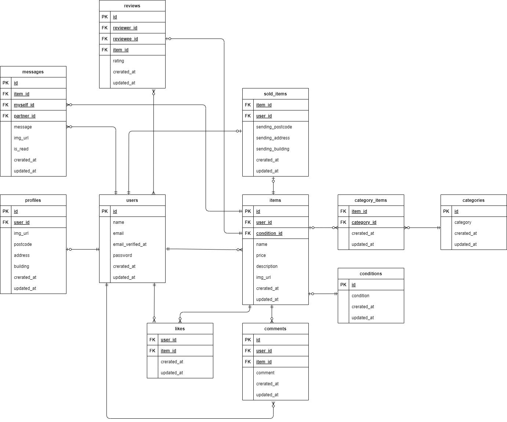

# 環境構築

1. Dockerを起動する
2. プロジェクト直下で、以下のコマンドを実行する

````
make init
````

## メール認証
mailtripというツールを使用しています。<br>
以下のリンクから会員登録をしてください。<br>
https://mailtrap.io/

メールボックスのIntegrationsから 「laravel 7.x and 8.x」を選択し、　<br>
.envファイルのMAIL_MAILERからMAIL_ENCRYPTIONまでの項目をコピー＆ペーストしてください。　<br>
MAIL_FROM_ADDRESSは任意のメールアドレスを入力してください。

## stripeについて
コンビニ支払いとカード支払いのオプションがありますが、決済画面にてコンビニ支払いを選択しますと、レシートを印刷する画面に遷移します。そのため、カード支払いを成功させた場合に意図する画面遷移が行える想定です。<br>

また、StripeのAPIキーは以下のように設定してください。
````
STRIPE_PUBLIC_KEY="パブリックキー"
STRIPE_SECRET_KEY="シークレットキー"
````

以下のリンクは公式ドキュメントです。<br>
https://docs.stripe.com/payments/checkout?locale=ja-JP

## ER図


## テストアカウント
name: 一般ユーザー  
email: general1@gmail.com  
password: password
----------------------------
name: 一般ユーザー  
email: general2@gmail.com  
password: password
----------------------------

## PHPunitを利用したテストに関して
以下のコマンド：
````
docker-compose exec php bash  
php artisan migrate:fresh --env=testing  
.vendor/bin/phpunit
````
※.env.testingにもStripeのAPIキーを設定してください。